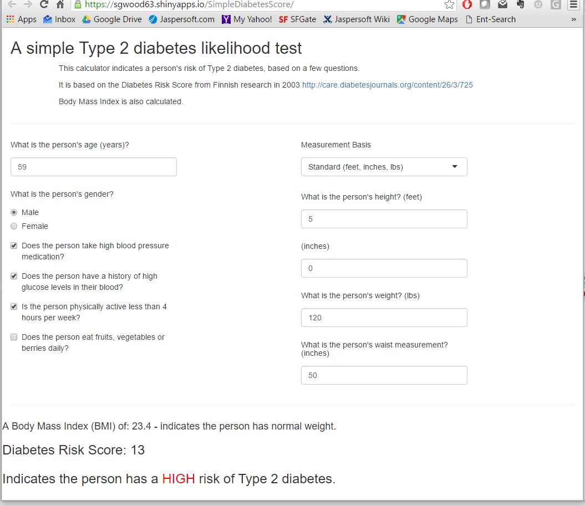

A Diabetes Risk Score Calculator
========================================================
author: Sherman Wood
date: September 5, 2016
autosize: true
***


A simple Diabetes Risk Score
========================================================

In 2003, Finnish researchers: Jaana Lindstrom and Jaakko Tuomilehto published The Diabetes Risk Score <http://care.diabetesjournals.org/content/26/3/725>.

This paper proposed a simple questionaaire to indicate a person's risk of Type 2 diabetes without requiring tests.

The calculator at <https://sgwood63.shinyapps.io/SimpleDiabetesScore/> automates this questionnaire to produce a Type 2 Diabetes Risk Score.
- The calulator implements the "full model" that includes all significant factors


Factors and Results of the Calculator
========================================================
Factors

- Person's age (years)
- Gender
- Use of high blood pressure medicine
- History of high blood glucose levels
- Amount of weekly physical activity
- Standard or Metric units
  - Height
  - Weight
  - Waist circumference

***
Results
- Body Mass Index: a metric of weight status
  - Includes rating from Underweight to Obese
- Type 2 Diabetes Risk Score
  - Score of 9 of above is high risk

Calculator Inputs and Results
========================================================

```r
source("./SimpleDiabetesScore/calculatorFunctions.R")
testData()
```

```
$heightMajor
[1] 6

$heightMinor
[1] 0

$weight
[1] 250

$standardUnits
[1] TRUE

$age
[1] 59

$waistMeasurement
[1] 33

$bloodPressureMedication
[1] FALSE

$male
[1] FALSE

$highGlucose
[1] FALSE

$eatWell
[1] FALSE

$notPhysicallyActive
[1] TRUE
```
***

```r
bmi(testData())
```

```
[1] 33.90572
```

```r
diabetesScore(testData())
```

```
[1] 9
```


Why the Calculator?
========================================================

- The questions are simple and do not require tests
- A person can do the questionnaire themselves and seek advice based on the results
- The factors emphasizes lifestyle effects of the score that can be changed by the person
- The research points to the effectiveness of the score. With a longitudinal study between 1987 and 1992:
  - the sensitivity of a positive score (>= 9) was 0.77
  - the negative predictive value of a score below 9 was 0.99


